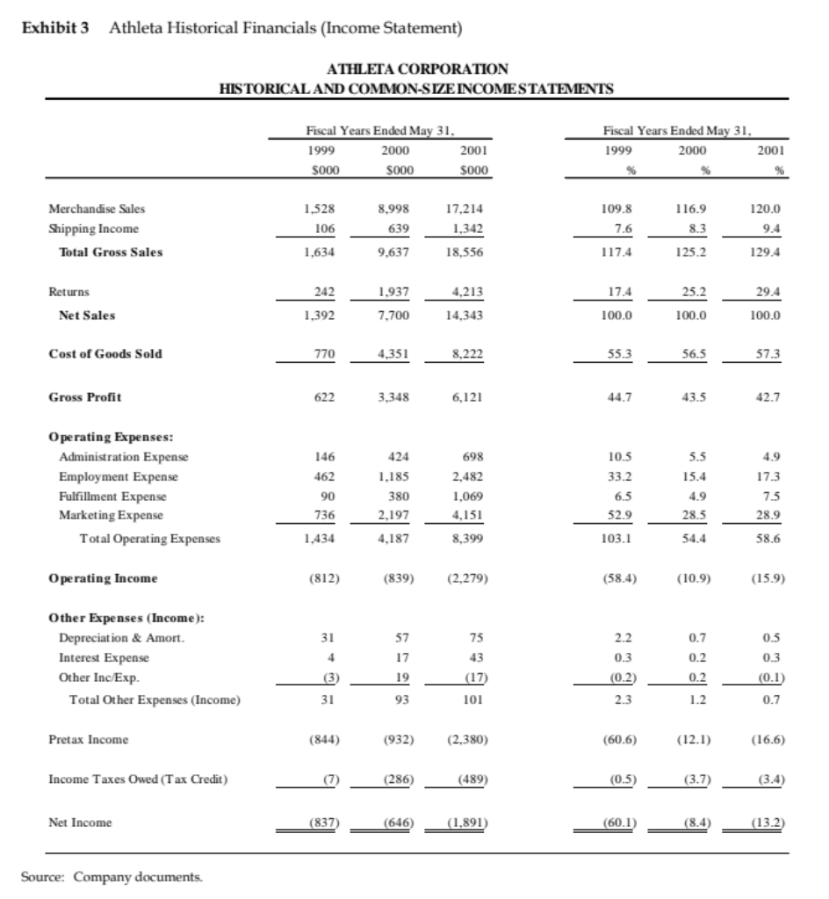
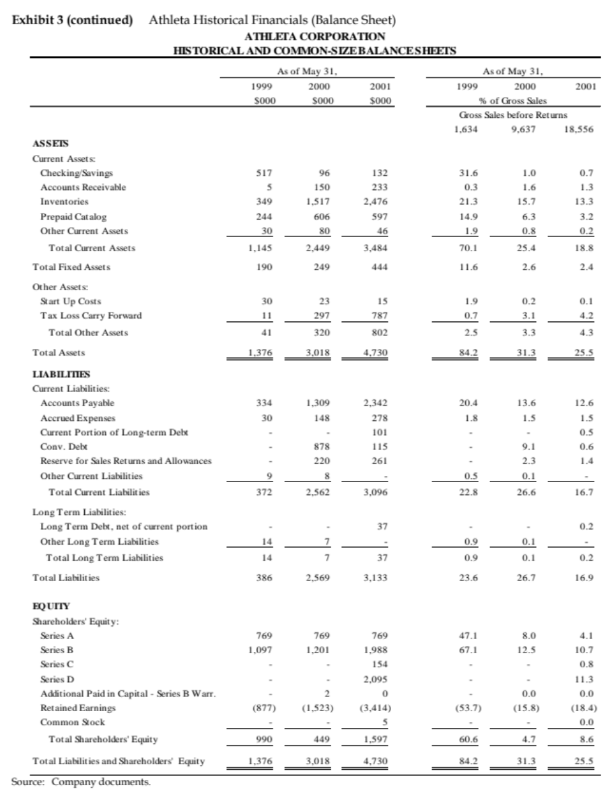
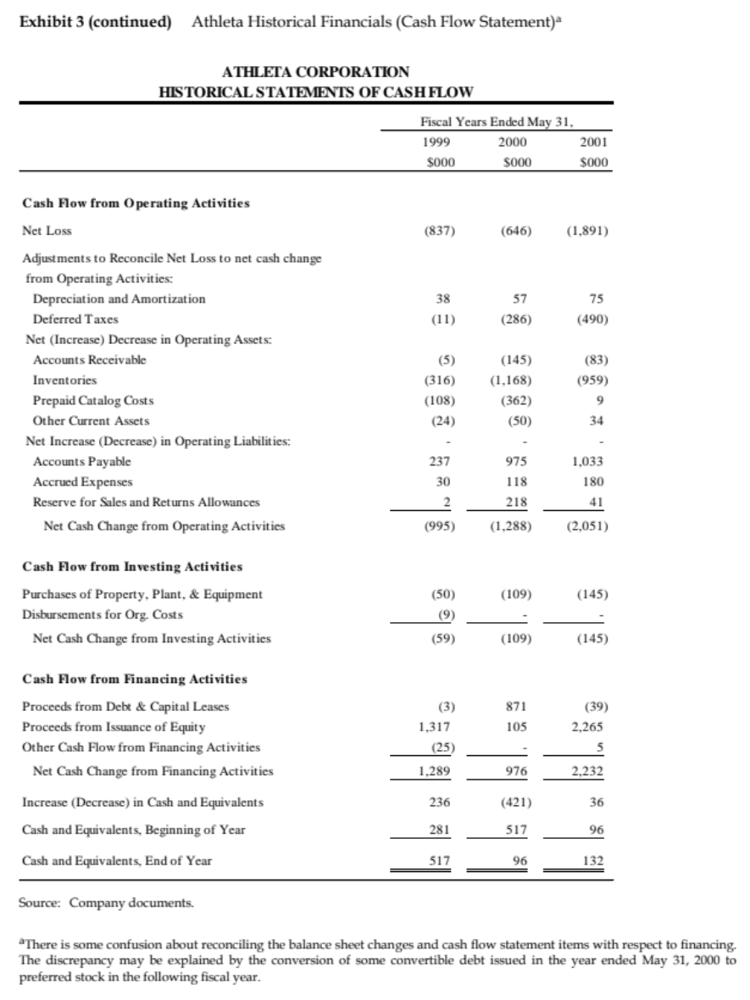
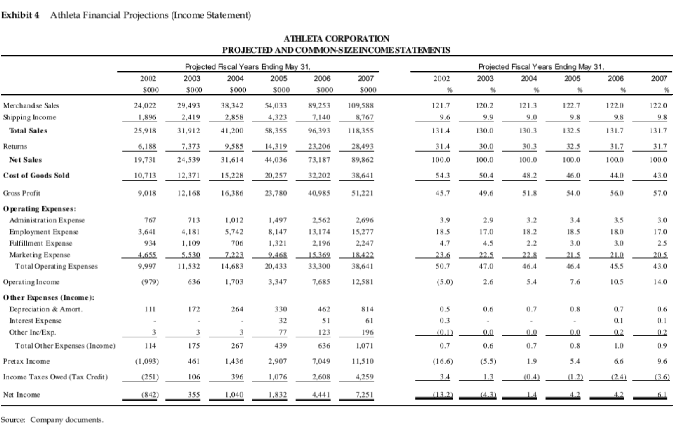
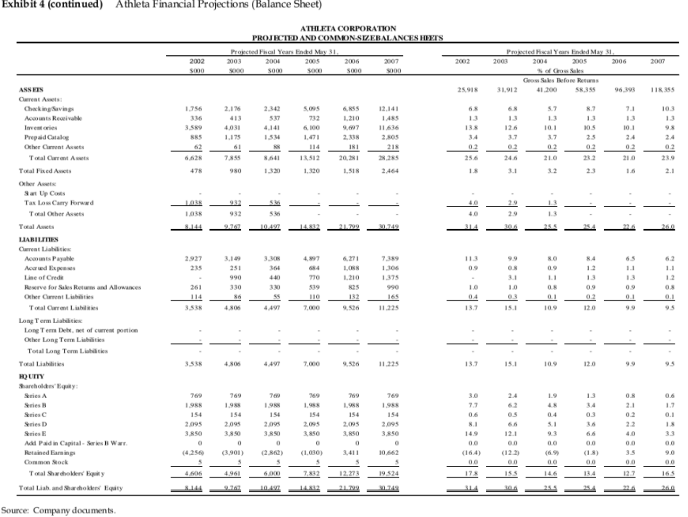
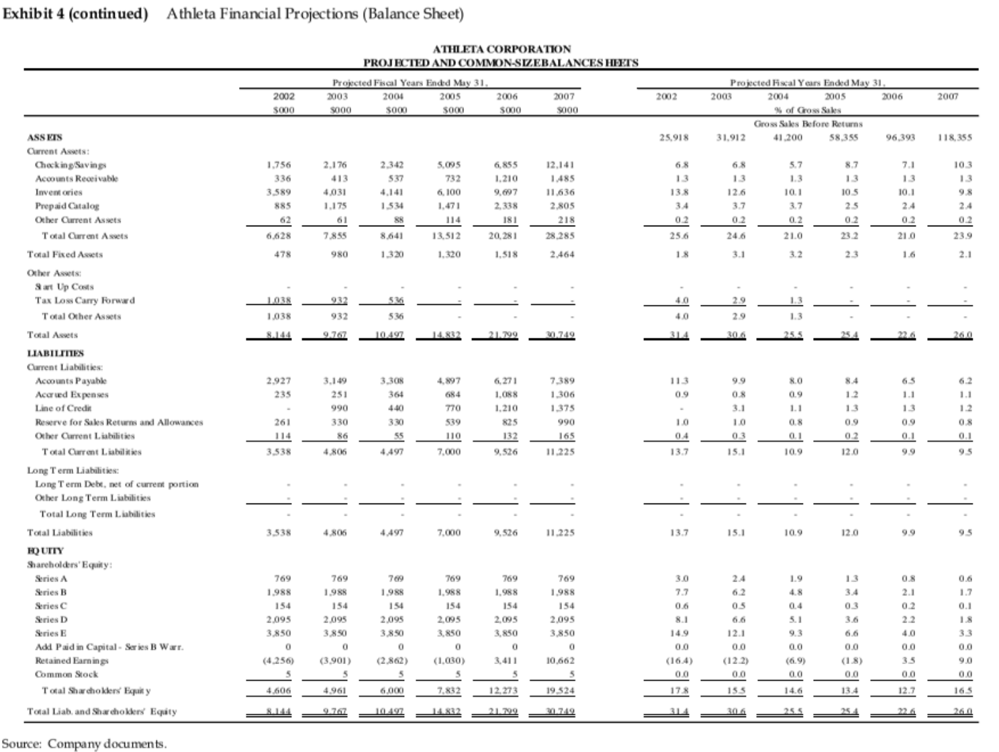
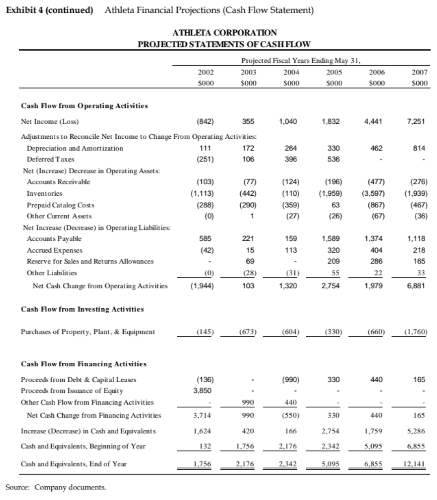
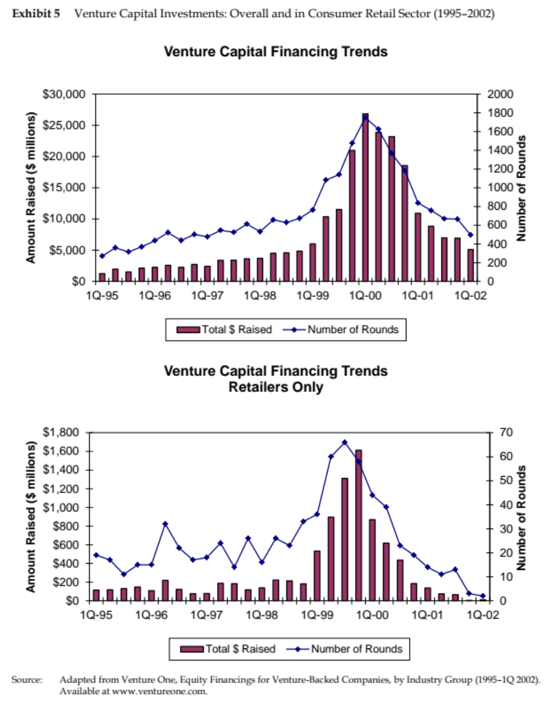
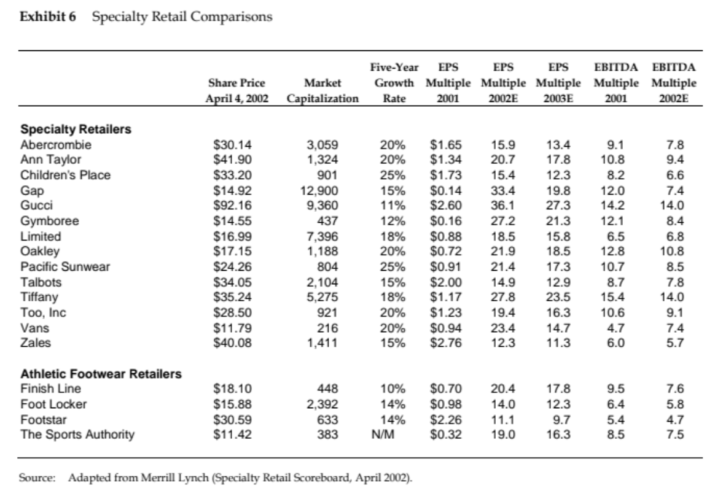

# Athleta (HBS 9-803-045) — 한국어 번역본

> 원문: Harvard Business School Case 9-803-045
> 저자: William A. Sahlman, Jas Frimerman-Agid
> 개정: 2003년 7월 25일

---

> *"기업가의 가장 두드러진 특성은, 우리가 거의 모든 것을 스스로에게 납득시킬 수 있다는 것이다."*
> — Scott Kerslake, Athleta 사장 겸 CEO

2002년 3월 26일 아침, Athleta의 사장 겸 최고경영자(CEO) Scott Kerslake는 맨해튼 교통 정체 속에 갇혀 낯선 도시의 소음을 들으며 생각에 잠겼다. 그 시각 캘리포니아주 페탈루마(Petaluma)에 있는 Athleta 본사에서는 직원들이 사무실 인근 공원으로 달리기를 나가거나 반려견을 데리고 산책을 준비하고 있었다. Kerslake와 수석 부사장(Senior VP) Joe Teno는 Athleta의 비즈니스 모델과 기업 문화를 이해하고 공감해 줄 투자자로부터 시리즈 E(Series E) 자금 조달을 마무리하기 위해 뉴욕을 방문 중이었다. Athleta의 잔여 현금은 **$50,000 미만(약 5만 달러)**이었으며, 추가 성장을 위한 자본 확보가 절실한 상황이었다.

1999년 Kerslake는 카탈로그·온라인·오프라인 매장을 포괄하는 멀티채널(Multi-channel) 플랫폼을 통해 여성 다목적 스포츠 의류를 판매하는 "여성 스포츠 회사"로 Athleta를 창립했다. 1998년부터 2002년 말까지 Athleta는 40만 건 이상의 주문을 처리하고, 500만 달러 미만의 자기자본(Equity Capital)으로 5,500만 달러 이상의 누적 매출을 달성할 것으로 예상했다. 과거부터 현재까지 영업 손실이 지속되었음에도 불구하고, Athleta는 당 회계연도 최초의 흑자 월을 기록했으며, 경영진은 회사가 다음 단계로 도약할 준비가 되었다고 판단하고 있었다.

1999년부터 2002년 사이 매출액은 수백만 달러 규모로 성장했다. 2002년 3월 현재 Athleta의 현금 잔고는 **$50,000 미만**이었다. Kerslake는 시리즈 E 라운드 확보가 추가 성장을 위한 필수 조건이라고 확신했다. 회사 지분의 상당 부분을 이미 보유하고 있어 불리한 투자 조건을 어느 정도 수용해야 할 수 있었지만, Kerslake는 무결성(Integrity)에 기반한 회사를 만들고자 했다. 그는 뉴욕에서 벤처 캐피탈(Venture Capital, VC) 회사들, 엔젤 투자자(Angel Investors), 그리고 상업은행(Commercial Banks)과 자금 조달 논의를 이어가고 있었다.

---

## 창업자의 비전 (Founder's Vision)

Kerslake는 항상 자신만의 회사를 설립하는 꿈을 가지고 있었다. Athleta 창업 이전, 그는 대학 졸업 후 소매업체에서 일하다가 1991년 Sapient Corporation에 경영 컨설턴트로 합류했다. 그곳에서 맡은 주요 고객사 중 하나가 Apple Computer였으며, 자사 제품에 깊은 열정을 가진 Apple 직원들과 함께 일한 경험은 그에게 큰 영감을 주었다. Apple 프로젝트 이후 그는 Sapient의 마케팅 이사(Director of Marketing)로 활동하며 1996년 회사의 성공적인 기업공개(IPO)를 이끄는 데 핵심적인 역할을 했다. 그 후 Kerslake는 자신만의 사업을 시작하기로 결심했다. 그는 다음과 같이 설명했다:

> *"어느 날, 나는 스포츠에 진지한 여성들을 위한 의류를 판매하는 카탈로그를 보다가 정말로 마음에 드는 제품이 없다는 것을 깨달았다. 기능적이면서도 스타일리시하고 여성의 체형에 잘 맞는 제품을 원하는 여성들의 수요를 충족시키는 브랜드가 없었다. 그것이 Athleta의 출발점이었다."*

---

## 여성 스포츠 의류 시장 (Women's Sports Apparel Market)

Athleta가 출범한 1999년, 여성의 스포츠·피트니스 참여는 이미 빠르게 증가하고 있었다. 여성 스포츠 의류 시장 규모는 1999년 기준 60억 달러 이상이었으며, 애널리스트들은 지속적인 강세 성장을 전망했다. 2000년 미국 여성들은 스포츠 의류에만 250억 달러를 지출한 것으로 나타났으며, 더 넓은 여성 의류 시장은 960억 달러를 상회했다.

### Table A: 여성 스포츠 참여 현황 (1999)

| 종목 | 여성/전체 참가자 비율 (Women/Total Participants) |
|------|--------------------------------------------------|
| 달리기 (Running) | 49% |
| 피트니스 (Fitness) | 56% |
| 수영 (Swimming) | 56% |
| 자전거 (Bicycling) | 44% |
| 에어로빅 (Aerobics) | 76% |
| 피트니스 센터 (Fitness Gym) | 72% |

*출처: 회사 자료*

---

## 경쟁 환경 (Competition)

Kerslake는 Athleta를 다양한 스포츠 종목에 걸쳐 엄선된 최고 제품군을 제공하고 탁월한 고객 서비스를 제공하는 프리미엄 멀티채널 여성 스포츠 의류 소매업체로 포지셔닝했다 (Exhibit 2 참조).

경쟁 구도는 크게 네 가지 유형으로 분류되었다:

- **Tier 1 (여성 스포츠 소매업체):** 여성 스포츠 의류에 집중하는 소매업체들로, 달리기·사이클링 등의 특정 종목에 특화되거나 다양한 스포츠 활동을 위한 제품을 제공. 예) Lady Footlocker
- **Tier 2 (전문 소매업체):** 특정 스포츠 종목에 특화된 전문 소매업체. 예) Fleet Feet, Recreation Equipment Incorporated(REI)
- **Tier 3 (대형 종합 소매업체):** 다수의 스포츠 이용자를 대상으로 폭넓은 스포츠 관련 제품군을 보유한 대형 매장. 예) Foot Locker, The Sports Authority
- **Tier 4 (백화점):** 스포츠 관련 제품의 좁은 선택지만을 보유하는 백화점 채널. 예) Nordstrom

---

## 채널 전략 (Channel Strategy)

Athleta는 카탈로그, 온라인, 오프라인 매장을 포괄하는 멀티채널(Multi-channel) 모델을 통해 고객에게 서비스를 제공했다. 일부 전자상거래(E-commerce) 기업들과 달리, Athleta 경영진은 전자상거래가 다른 채널을 잠식한다고 보지 않았다. 오히려 여러 채널에 걸쳐 운영하는 기업들과 더 강력한 고객 관계가 형성된다고 믿었다.

구매 행동에 관한 연구에 따르면, 카탈로그 쇼핑객 중 웹사이트를 방문한 고객은 연간 **50% 더 많은 금액**을 지출하고, 카탈로그 구매 빈도도 **11% 증가**하는 것으로 나타났다. 경영진은 Athleta.com 웹사이트가 카탈로그 매출을 11% 이상 끌어올리는 효과가 있으며, 향후 오프라인 매장 확장을 통해 고객 관계를 더욱 심화할 수 있다고 확신했다.

---

## 제품 (Product)

Athleta의 제품 라인은 'Athleta Essentials'라는 자체 브랜드(Private-label Brand) 액티브웨어에서 시작되었다. Athleta Essentials는 고객들이 원하지만 기존에는 구할 수 없었던 색상·핏·기능성을 갖춘 제품들로 구성되었다. 자체 브랜드 제품 출시는 단순히 마진 확대를 위한 것이 아니라, 기존의 다른 고품질 브랜드와 함께 고객에게 최고의 제품 선택지를 제공하겠다는 의지에서 비롯되었다.

초기 목표 고객은 **18~49세의 대학 교육을 받은 여성**으로, 가구 소득이 **$85,000 이상**이었다. 이들은 신체적으로 활동적이고 스포츠를 진지하게 즐기며, 기능성과 패션을 모두 갖춘 멀티스포츠 의류를 원했다.

Athleta 브랜드는 여성의 삶에서 스포츠와 체육이 갖는 중요성에 대한 이해와 존중을 전달하도록 설계되었다. 회사의 카탈로그는 진정한 스포츠 브랜드임을 증명하기 위해 **51% 이상의 스포츠 퍼포먼스 이미지**를 담았다. 이는 정확한 정보 제공, 사려 깊은 조언, 그리고 스포츠에 참여하는 여성의 특별한 니즈를 이해한다는 Athleta의 브랜드 약속과도 일치했다.

---

## 기업 문화 (Culture)

Athleta는 직원들이 자사의 사명을 진심으로 믿고 고객 서비스와 최고의 제품에 집중할 수 있는 문화를 만들기 위해 노력했다. 판매 부서에서도 판매 목표만을 강요하는 대신, 감성 지능(Emotional Intelligence)에 기반하여 각 고객에게 최적의 제품을 선택하도록 돕는 데 집중했다.

직원들은 가족을 사무실에 데려와도 되고, 사무실 인근에서 달리기나 사이클을 즐겨도 되며, 점심 시간에 개인 훈련을 해도 된다는 장려를 받았다. 오픈 플로어 플랜(Open-plan Office)의 사무실은 열린 소통과 팀워크를 촉진하도록 설계되었다.

Athleta 직원들은 스포츠에 참여하는 여성의 삶을 직접 체험하는 사람들이었으며, 이러한 진정성이 고객 서비스와 제품 기획 전반에 깊이 배어 있었다. 이러한 높은 수준의 직원 몰입에는 단점도 있었는데, 판매 부서보다는 스포츠에 더 열정적인 인재를 채용하기 어렵다는 점이었다.

---

## 회사 역사 (Company History)

Athleta 콘셉트를 개발하고 여성 스포츠 산업에 대한 시장 조사를 수행한 후, Kerslake는 Series A 라운드를 위한 자금 조달을 시작했다. 1999년 Series A 라운드에서는 약 $59만 달러를 $0.75 주당 우선주(Preferred Stock) 가격으로 조달했으며, 이후 Series B~D까지 순차적으로 추가 자금을 유치했다. 초기 VC 투자자들은 기업의 전체적인 비즈니스 모델보다는 인터넷 비즈니스 모델 자체에 집중하는 경향이 있었다. Athleta는 이미 Series A에서 $59만 달러를 인터넷 기반 투자자들로부터 조달했다.

1990년대 후반~2000년대 초반의 닷컴 버블(Dot-com Bubble) 붕괴는 VC 시장 전반에 걸쳐 극심한 충격을 가져왔다. 수백 개의 기업이 파산을 선언하는 상황에서, 소비자 소매 부문에 특화된 VC들은 이미 대거 시장에서 이탈해 있었다. 이로 인해 Athleta의 Series E 자금 조달은 매우 어려운 상황에 처하게 되었다.

---

## 성장 계획 (Plans for Growth)

Kerslake는 처음부터 Athleta 비즈니스를 진심으로 믿는 직원들을 채용하는 데 집중했다. 그는 다음과 같이 설명했다:

> *"당신이 할 수 있는 것과 당신이 실제로 감당할 수 있는 것 사이에는 커다란 간극이 있습니다. 그 간극을 메우는 유일한 방법은 땀과 열정과 헌신입니다."*

> *"많은 회사들이 투자금을 받고 나서 결국 자신들이 원하는 대로 하기로 결심했다는 것을 알고 있습니다. 우리는 우리의 원칙을 고수했습니다. 기업 가치를 지키며 회사를 만드는 것은 가장 어려운 일입니다. 그래서 우리는 그것을 지켜왔고, 취약한 상태를 유지합니다. 왜냐하면 그것이 우리 회사의 본질이며, 고객들이 우리를 사랑하는 이유이기 때문입니다."*

> *"자본이 충분하지 않다는 것은 정말 힘든 일입니다. 우리는 지출에 있어 항상 매우 신중하고, 무엇에 돈을 쓸지에 대해 항상 꼼꼼했습니다. 시리즈 E 자금을 통해, 우리는 진짜라고 생각하는 모든 기회를 실행에 옮길 수 있게 됩니다. 회사를 다음 단계로 끌어올릴 충분한 자본이 없었기 때문에, 우리는 유기적(Organic)으로 성장해왔습니다."*

경영진은 Athleta를 선도적인 멀티채널 여성 스포츠 의류 회사로 성장시키기 위한 전략적 성장 계획을 수립했다.

### Table B: Athleta 운영 실적 및 예측 요약

| 항목 | FY1999 | FY2000 | FY2001 |
|------|--------|--------|--------|
| 순매출액 (Net Sales, $M) | $1.39M | $7.7M | $14.3M |
| 매출총이익률 (Gross Margin) | ~43% | ~43% | ~43% |
| 평균 주문 금액 (Average Order Value) | — | — | ~$103 |
| 카탈로그 응답률 (Response Rate) | — | — | ~6.6% |

*주: 회계연도(FY)는 5월 31일 종료 기준 / 정확한 수치는 원본 Exhibit 3, 4 참조*

### Table C: Athleta 자금 조달 내역

| 항목 (Area) | 자금 용도 (Purpose of Proceeds) | 필요 자금 |
|-------------|--------------------------------|-----------|
| 카탈로그 발행 증가 (Catalog Circulation Growth) | 연간 발행 부수 600만부로 확대 | $1.48M |
| 공급업체 조건 개선 (Supplier Terms Improvement) | 선급 결제 의무 해소 | $0.68M |
| 인프라/물류센터 업그레이드 (Infrastructure/Distribution) | MIS 시스템 및 물류센터 개선 | $0.58M |
| 인적 자원 (Human Resources) | 핵심 인력 채용 | $0.22M |
| 상품 기획/매장 확장/마케팅 (Merchandising/Store/Marketing) | 자체 브랜드 확장 및 마케팅 | $0.47M |
| **합계** | | **$3.43M** |

*출처: 회사 자료*

---

### 1. 카탈로그 발행 확대를 통한 고객 기반 확장

카탈로그 사업은 신규 고객 확보에 크게 의존한다. Athleta는 **6.4%의 응답률(Response Rate)**과 **평균 주문 금액 $138**를 달성했는데, 이는 업계 평균 응답률인 2%와 비교하여 현저히 우수한 성과였다. 경영진은 카탈로그 발행 부수를 대폭 확대하더라도 이러한 성과 지표가 유지되거나 향상될 것이라고 믿었다.

### 2. 공급업체 결제 조건 개선

2002년 당시 Athleta는 일부 주요 공급업체에 선급 결제(Prepayment) 의무가 있어 현금 흐름에 부정적인 영향을 미쳤다. 시리즈 E 자금의 일부를 활용하여 더 유리한 결제 조건(Net 30~60일)을 협상함으로써 운전자본(Working Capital) 효율성을 개선할 수 있을 것으로 기대했다.

### 3. 경영 정보 시스템(MIS) 업그레이드 및 인프라 개선

Athleta의 급속한 성장으로 인해 본사 경영 정보 시스템(Management Information Systems, MIS)과 물류 센터 업그레이드가 필요했다. 물류센터 확장에 $20만 달러를 추가 투자할 계획이었다.

### 4. 자체 브랜드(Private-Label Brand) 확장

Athleta Essentials 자체 브랜드 제품 라인 확장은 마진 개선의 핵심 동력이었다. 자체 브랜드 제품의 매출 비중을 높임으로써 수익성을 향상시킬 수 있었으며, Athleta는 일부 고품질 외부 브랜드 제품과 자체 브랜드를 함께 운영하는 전략을 유지했다.

### 5. 팀 확장 및 마케팅 이니셔티브

Athleta는 고객 서비스, 물류, 웹 개발 분야에 핵심 인력 채용을 계획하고 있었다.

---

## 파이낸싱 옵션 (Financing Options)

Kerslake와 Teno는 2002년 3월 말 뉴욕을 방문하여 다양한 자금 조달 옵션을 모색했다. Athleta의 현금 잔고는 **$50,000 미만**으로, 새로운 자본 조달이 시급한 상황이었다.

### 벤처 캐피탈 (Venture Capital)

2002년 1분기는 VC 시장의 바닥 국면이었다 (Exhibit 5 참조). 수백 개의 기업이 파산을 선언하며 경제적 수익을 창출하지 못했고, 이러한 상황에서 **소비자 소매 부문에 특화된 VC들은 이미 시장에서 대거 이탈**해 있었다. 자본 시장 환경이 매우 좋을 때에도 매출 성장의 강도와 수익성 경로를 요구하는 것이 VC의 일반적인 관행이었는데, 닷컴 버블 붕괴 이후의 환경에서는 이러한 기준이 더욱 엄격해졌다.

VC를 찾는 것 자체가 매우 어려웠다. 또한 소비자 소매 분야에서의 리스크에 민감해진 VC들은 강력한 성장 스토리와 명확한 투자 회수(Exit) 경로를 요구했다. 내부 수익률(IRR)에 초점을 맞추는 VC들은 소비자 직판(Direct-to-consumer) 소매 비즈니스의 낮은 성장 배수(Multiple)를 우려했다.

### 엔젤 투자자 (Angel Investors)

2002년 당시 수천 명에 달하는 엔젤 투자자(Angel Investor)들이 있었으며, 이들은 일반적으로 **$75만 달러에서 $200만 달러 규모**의 개인 기업 지분을 취득하는 소규모 투자를 제공할 수 있었다. 일반적인 투자 체크 규모는 $75만 달러에서 $100만 달러였다.

현금 부족 상황에서 Kerslake는 다수의 엔젤 투자자로부터 자금을 조달하는 데 필요한 시간과 노력이 우려되었다. 또한 이들은 순수한 재무적 수익보다는 회사의 "파트너(Partner)"가 되기를 원하는 경향이 있었다. 일부 엔젤 투자자들은 프로 운동선수나 전문직 종사자, 유명인 등으로 구성된 그룹이었으며, 이들은 Athleta의 브랜드 앰배서더(Brand Ambassador) 역할도 할 수 있었다.

그러나 단일 엔젤 투자자의 투자 규모가 제한적이어서, 필요한 $343만 달러를 충당하기 위해서는 여러 명의 엔젤을 모아야 한다는 어려움이 있었다.

### 상업은행 (Commercial Banks)

세 번째 자금 조달 옵션은 상업은행(Commercial Banks) 대출이었다. 소액의 부채(Debt)를 조달함으로써 다른 소스에서 시리즈 E를 확보할 시간을 벌 수 있었다. 그러나 **2002년 상업은행들은 매우 인색한(tight-fisted) 태도**를 보였으며, 소비자 소매 기업에 대한 대출 의향이 낮은 상황이었다.

---

## 결론

Kerslake는 Athleta를 위한 건전한 자금 조달 계획을 수립하기 위해 분주하게 움직였다. 매일 그의 회사는 수백 명의 여성이 자신의 니즈에 맞는 스포츠 의류를 찾는 데 도움을 주고 있었다. Kerslake는 Athleta가 오프라인 소매 매장으로 진출하면 여성 운동선수를 위한 수십 가지 새로운 기회가 열릴 것이라고 확신했다. 이제 남은 과제는 Athleta를 다음 단계로 이끌 자본을 확보하는 것뿐이었다.

---

## Exhibit 1: 경영진 약력 (Management Biographies)

**Scott Kerslake** — 사장 겸 CEO (President & CEO)

Kerslake는 Athleta를 창업하고 운영해왔다. 대학 졸업 후 소매업계에서 경력을 시작했으며, 이후 Sapient Corporation에서 경영 컨설턴트로 일했다. Apple Computer 프로젝트 등 주요 고객사를 담당했으며, 이후 Sapient의 마케팅 이사(Director of Marketing)로 승진하여 1996년 회사의 성공적인 IPO를 주도했다. Athleta를 창업하기 전에는 The Sports Authority에서도 역할을 맡았다.

**Joe Teno** — 수석 부사장 운영 (Senior VP of Operations)

Teno는 운영 예산 관리와 직접 고객 담당 팀 총괄을 책임지고 있다. Athleta 합류 이전에는 Travelers 소속에서 6,500만 달러 규모의 직접 마케팅(Direct Marketing) 사업을 담당하는 총괄 이사(General Director)를 역임했으며, 품질 관리 및 인적 자원 분야에서 13년 이상의 경력을 쌓았다.

**Noelle Della Chiesa** — 컨트롤러 (Controller)

Della Chiesa는 재고 예측, 계획, 구매 분야에서 18년의 경력을 보유하고 있다. 이전에는 Roland Mendez의 수석 재정 기획가(Principal Financial Planner)로 활동하며 스포츠 예측 및 공급망 관리(SCM) 보고를 담당했다.

**Elizabeth Howland** — 유통 이사 (Director of Circulation)

Howland는 유통, 마케팅, 관리 분야에서 광범위한 경험을 보유하고 있다. 이전에 Gymboree의 상품 기획 이사(Director of Merchandising)를 역임했다.

**Lori Overton** — 상품 기획 이사 (Director of Merchandising)

Overton은 재고 예측, 계획, 구매 분야에서 18년의 경력을 보유하고 있다. 이전에 Boltholes에서 상품 기획과 구매를 담당했으며, Macy's에서 6년간 마케팅 매니저로 재직했다.

**Tami Anderson** — 마케팅 및 브랜드 개발 이사 (Director of Marketing and Brand Development)

Anderson은 Athleta의 마케팅 및 브랜드 개발을 책임지고 있다. 이전에 샌디에이고 기반의 독립 출판사인 Gryphon Books에서 마케팅 이사로 활동했으며, 포춘 500대 기업 마케터로 커리어를 시작했다. Athleta의 내부·외부 모든 광고 업무와 회사 브랜드 구축을 총괄하고 있다.

**Ellen Krimmel** — 고객 서비스 이사 (Director of Customer Service)

Krimmel은 Athleta의 고객 서비스 운영을 책임지고 있다. 이전에 Saturn Women's Cycling Team의 기술 이사(Technical Director)를 역임했으며, Esprit DC Corp.에서 의류 디자이너로 일했다. 대학 시절 MVP를 수상한 스포츠 활동 이력이 있으며, University of Vermont 졸업생이다.

**Lara Dittoe** — 제품 관리자 (Product Manager)

Dittoe는 스포츠 의류 분야에서 10년 이상의 경력을 보유하고 있으며, Pacific Northwest 출신으로 멀티스포츠 마케팅을 담당하고 있다.

**Kathy Frank** — 물류 유통 이사 (Director of Distribution)

Frank는 Athleta의 유통 운영을 책임지고 있다. 이전에 Illuminations에서 카탈로그 유통 운영을 총괄했으며, 여성 의류 제품 유통 분야에서 25년 이상의 경력을 보유하고 있다.

---

## Exhibit 2: 여성 스포츠웨어 경쟁 구도 (Women's Sportswear Competitive Space)

| **1. 여성 스포츠 소매업체** (Women's Sports Retailers) | **2. 전문 소매업체** (Specialty Retailers) |
|-------------------------------------------------------|------------------------------------------|
| Athleta **[C, O]** | REI **[R, C, O]** |
| Title 9 Sports **[C, O]** | EMS **[R, O]** |
| Lady Footlocker **[R]** | Performance Bike **[R, C, O]** |
| | Road Runner Sports **[C, O]** |
| | Colorado Cyclist **[C, O]** |

| **3. 대형 종합 소매업체** (Big Box Retailers) | **4. 백화점** (Department Stores) |
|---------------------------------------------|----------------------------------|
| Foot Locker **[R]** | Neiman Marcus **[R, C, O]** |
| The Sports Authority **[R, O]** | Macy's **[R, C, O]** |
| Gart Sports **[R]** | Nordstrom **[R, C, O]** |
| Copeland's **[R]** | Robinson's-May Co. **[R, C, O]** |
| Global Sports **[O]** | |
| Hibbett Sports **[R]** | |
| Sport Mart **[R]** | |
| Big 5 **[R]** | |

> **범례:** R = 오프라인 소매업체(Offline Retailer) / O = 온라인 소매업체(Online Retailer) / C = 카탈로그 소매업체(Catalog Retailer)

*출처: 회사 자료*

---

## Exhibit 3: 과거 재무제표 (Historical Financial Statements)

### 손익계산서 (Income Statement)

### 대차대조표 (Balance Sheet)

### 현금흐름표 (Statement of Cash Flows)

---

## Exhibit 4: 재무 예측 (Financial Projections)

### 예상 손익계산서 (Projected Income Statement)

### 예상 대차대조표 (Projected Balance Sheet)

### 예상 현금흐름표 (Projected Statement of Cash Flows)

---

## Exhibit 5: VC 파이낸싱 트렌드 (Venture Capital Financing Trends)

---

## Exhibit 6: 전문 소매업체 비교 (Specialty Retailer Comparables)

